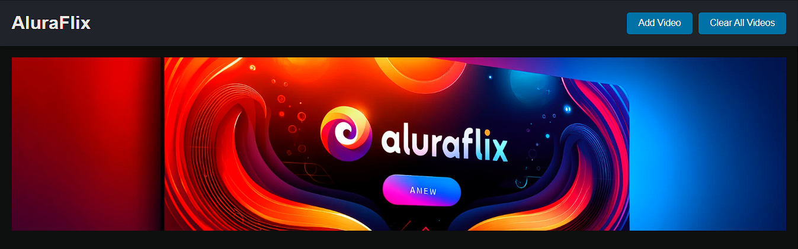
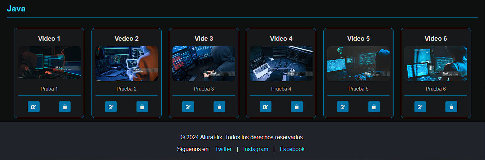
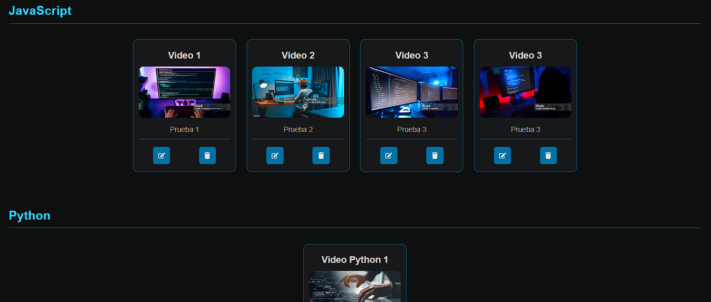

# AluraFlix

AluraFlix es una plataforma para ver y compartir videos sobre temas interesantes.

## Instrucciones de Uso

1. Clona este repositorio.
2. Instala las dependencias con `npm install`.
3. Inicia la aplicación con `npm run dev`.

Este proyecto utiliza Vite como su herramienta de desarrollo.

## Funcionalidades Principales

- Ver lista de videos organizados por categorías.
- Agregar nuevos videos.
- Editar y eliminar videos existentes.

## Capturas de Pantalla

## Contribución

Si quieres contribuir a este proyecto, por favor sigue estos pasos:
1. Haz un fork del proyecto.
2. Crea una nueva rama (`git checkout -b feature/nueva-funcionalidad`).
3. Haz commit de tus cambios (`git commit -am 'Añade nueva funcionalidad'`).
4. Sube tus cambios (`git push origin feature/nueva-funcionalidad`).
5. Abre un Pull Request.

## Licencia

Este proyecto está licenciado bajo la Licencia MIT - consulta el archivo LICENSE.md para más detalles.

